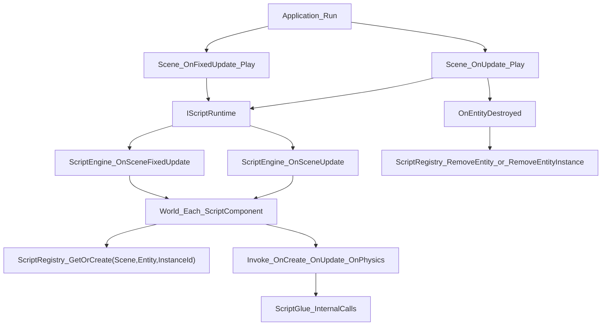

# Ehu Scripting 模块说明（用途、技术与构建）

本文档面向两类读者：

- 想知道“脚本模块在引擎里到底做什么”的开发者。
- 不熟悉 Mono/C#/构建链路、但需要快速上手的使用者。

当前实现基于 **Mono + C#**，并与 `Scene/ECS` 紧耦合。

---

## 1. 这个模块是做什么的

一句话：`Scripting` 让“挂在实体上的 C# 脚本”在引擎里可创建、可调用、可序列化、可热重载。

它解决的核心问题：

1. **生命周期驱动**：自动调度 `OnCreate` / `OnUpdate` / `OnPhysicsUpdate` / `OnDestroy`。
2. **互操作桥接**：C++ 调 C#（生命周期）；C# 调 C++（InternalCall 白名单）。
3. **状态持久化**：脚本字段保存在 ECS 组件中，支持 Inspector 编辑与场景存档。
4. **运行时安全**：托管异常捕获、实例句柄集中回收，避免悬挂对象。
5. **迭代效率**：程序集变化后请求重载，尽量复用已保存字段状态。

---

## 2. 目录与角色（先看这个）

**根目录托管层**（C# 工程、DLL 产出）的独立说明见 [Scripting/README.md](../../Scripting/README.md)；下文 2.1 / 2.2 与引擎内 C++ 模块对照阅读即可。

### 2.1 原生侧（C++）

- `Ehu/src/Ehu/Scripting/ScriptEngine.*`：脚本运行时总门面（初始化、调度、重载）。
- `Ehu/src/Ehu/Scripting/ScriptRegistry.*`：托管实例索引表，管理 `GCHandle` 生命周期。
- `Ehu/src/Ehu/Scripting/ScriptGlue.*`：`mono_add_internal_call` 绑定层。
- `Ehu/src/Ehu/Scripting/IScriptRuntime.h`：给 `Scene` 调用的最小接口。

### 2.2 托管侧（C#）

- `Scripting/CSharp/Ehu.ScriptCore/`：引擎托管 API（InternalCalls 声明和封装）。
- `Scripting/CSharp/Game/`：示例/项目脚本程序集。
- `Scripting/CSharp/Ehu.Scripting.sln`：上述两个 C# 项目的解决方案。

---

## 3. 核心技术与边界

### 3.1 Mono 嵌入（Embedding）

- 引擎在 C++ 中创建 Mono 域并加载程序集。
- C# 脚本类方法由 C++ 反射缓存后调用。
- 这是“把 .NET 运行时嵌入引擎进程”的典型做法。

### 3.2 InternalCall（受控白名单）

- C# 中的 `extern` 方法映射到 C++ 实现。
- 统一注册入口在 `ScriptGlue::RegisterInternalCalls()`。
- 当前覆盖日志、时间、Transform 读写、实体信息、输入查询等能力。

### 3.3 ECS 持久数据与托管实例分离

- **持久层**：`ScriptComponent.Instances[]` 存 `InstanceId/ClassName/Fields`。
- **运行层**：`ScriptRegistry` 存托管对象与句柄。
- 这样场景文件不会直接序列化 Mono 对象，职责清晰、可恢复。

### 3.4 多脚本实例（含同类型重复）

- 同一实体可挂多个脚本实例。
- 唯一性靠 `InstanceId`（UUID）。
- 执行顺序即 `Instances` 列表顺序（Inspector 可调整）。

---

## 4. 关键模块说明（按职责）

### 4.1 `ScriptEngine`

职责：

- 管理 Mono 与程序集生命周期。
- 驱动场景帧更新和固定步更新。
- 做字段同步（ECS <-> 托管对象）。

重点方法分组：

- 运行时：`Init()` / `Shutdown()` / `IsInitialized()`
- 程序集：`LoadCoreAssembly()` / `LoadAppAssembly()` / `ReloadAssemblies()` / `RequestAssemblyReload()`
- 调度：`OnSceneUpdate()` / `OnSceneFixedUpdate()` / `OnSceneDestroyed()` / `OnEntityDestroyed()`
- 反射字段：`InitializeScriptComponentFields()` / `GetScriptFieldInfos()`

### 4.2 `ScriptRegistry`

职责：

- 维护 `(Scene*, Entity, InstanceId) -> ScriptRuntimeInstance` 映射。
- 提供实例复用、查找与集中清理。

重点接口：

- 获取：`GetOrCreate()` / `Find()` / `GetManagedObject()`
- 清理：`RemoveEntityInstance()` / `RemoveEntity()` / `RemoveScene()` / `Clear()`

### 4.3 `ScriptGlue`

职责：

- 注册并承接 C# 到 C++ 的 InternalCall。
- 把“脚本可见能力”收敛为可控 API 面。

当前典型调用：

- `Log_Native`
- `GetDeltaTime_Native` / `GetFixedDeltaTime_Native`
- `GetPosition_Native` / `SetPosition_Native`
- `GetScale_Native` / `SetScale_Native`
- `GetRotationEuler_Native` / `SetRotationEuler_Native`
- `GetTag_Native` / `SetTag_Native`
- `IsKeyPressed_Native` / `IsMouseButtonPressed_Native` / `GetMousePosition_Native`

### 4.4 `IScriptRuntime`

职责：

- 让 `Scene` 面向接口调用脚本系统，不依赖具体实现细节。

接口：

- `OnSceneUpdate`
- `OnSceneFixedUpdate`
- `OnSceneDestroyed`
- `OnEntityDestroyed`
- `OnPlayModeChanged`

---

## 5. 运行调用链（现在实际怎么跑）



简化理解：

1. `Scene` 负责“什么时候调脚本”。
2. `ScriptEngine` 负责“调哪个实例、调哪个方法、怎么同步字段”。
3. `ScriptRegistry` 负责“托管实例活多久、怎么回收”。
4. `ScriptGlue` 负责“C# 能反调哪些 C++ API”。

---

## 6. 构建与部署（新手必看）

### 6.1 先编 C++ 引擎

在项目根目录：

```powershell
.\build-scripts\gen_compile_commands.ps1
.\build-scripts\build_ninja.ps1
```

作用：

- 第一个脚本：生成 `build-ninja/` 与 `compile_commands.json`。
- 第二个脚本：执行 `ninja` 编译 C++ target（如 `EhuLib`、`SandBox`、`EhuEditor`）。

### 6.2 再编 C# 脚本程序集

在项目根目录：

```powershell
.\build-scripts\build_script_core.ps1
```

或在 `Scripting/CSharp`：

```powershell
dotnet build Ehu.Scripting.sln -c Release
```

输出：

- `Scripting/CSharp/Ehu.ScriptCore/bin/Release/net48/Ehu-ScriptCore.dll`
- `Scripting/CSharp/Game/bin/Release/net48/Game.dll`

### 6.3 部署到项目

- 将上面两个 DLL 放入项目资产目录 `Scripts/`。
- 路径由 `.ehuproject` 的 `ScriptCoreAssembly` / `ScriptAppAssembly` 指定。
- 默认值来源见 `Ehu/src/Ehu/Project/Project.cpp`。

### 6.4 `bin` 和 `obj` 的区别

- `bin/`：最终输出（可部署 DLL）。
- `obj/`：中间产物（还原缓存、临时编译文件、NuGet 生成文件），可再生。

---

## 7. 常见问题与排错

### 7.1 C++ 构建时报 `rc` / `kernel32.lib` 找不到

- 原因：未在 VS 开发者环境下执行工具链。
- 处理：优先使用 `build-scripts` 提供的脚本，不手写散乱命令。

### 7.2 脚本系统编译通过但运行不可用

- 检查是否正确配置 `MONO_ROOT` 并启用 `EHU_ENABLE_MONO`。
- 未启用时，C++ 仍可能编译通过，但脚本运行时不可用。

### 7.3 `dotnet build` 失败或 net48 相关错误

- 安装 `.NET Framework 4.8 Developer Pack` 和 `.NET SDK`。
- 确认项目目标框架为 `net48`（见两个 `.csproj`）。

### 7.4 我看到很多 `obj/*.nuget.*` 文件，不认识

- 这是自动生成的中间文件，不是手写源码。
- 源码主要看 `Scripting/CSharp/**.cs` 与 `.csproj`。

---

## 8. 当前实现状态与下一步建议

当前已具备：

- 脚本生命周期（含 `OnPhysicsUpdate` 固定步）。
- 多脚本实例（同实体可重复挂同类型，按列表顺序执行）。
- 字段同步、场景序列化、热重载请求链路。
- Inspector 对多实例的增删改与顺序调整。

建议继续补强：

1. 将固定步长与脚本参数暴露到项目配置或编辑器。
2. 扩展 InternalCall（资源、物理查询、实体查找等）。
3. 强化字段类型系统（枚举、数组、对象引用等）。
4. 增加内置调试开关，简化 Mono 调试接入。

---

## 9. 回归检查清单

- 无项目/无场景/无脚本组件时不崩溃。
- Play/Stop 切换后，脚本实例生命周期正确。
- 同一实体多个同类型脚本按列表顺序执行。
- 修改字段后保存再重启，值可恢复。
- 替换 DLL 后可触发重载且不出现悬挂实例。
