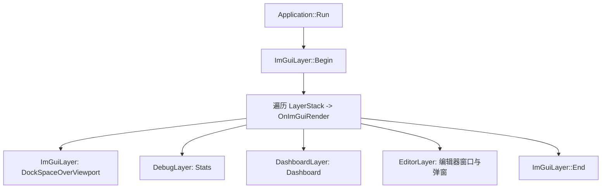

# ImGui 模块说明

本文档说明 Ehu 中 Dear ImGui 的接入方式、数据流、已实现的面板，以及窗口与 Layer 的层级关系。

---

## 1. 模块定位

ImGui 模块承担两类职责：

1. 将 Dear ImGui 接到当前窗口系统（GLFW）与图形后端（OpenGL 3.3）。
2. 作为调试与编辑器 UI 框架：菜单栏、DockSpace、统计面板、场景视口、资源浏览器、检视器等。

`SandBox` 主要使用引擎内置的调试面板；`EhuEditor` 在此基础上叠加 `EditorLayer` 与专用面板。

---

## 2. 相关库与程序引入

### 2.1 依赖

- **Dear ImGui**：即时模式 GUI。
- **imgui_impl_glfw**：ImGui 的 GLFW 平台后端（窗口、输入）。
- **imgui_impl_opengl3**：ImGui 的 OpenGL3 渲染后端（将 `ImDrawData` 提交到 GPU）。
- **GLFW / OpenGL 3.3 / GLAD**：与当前默认后端一致。

源码中通过 `ImGuiBuild.cpp` 编译进官方 backend 实现：

```cpp
#define IMGUI_IMPL_OPENGL_LOADER_GLAD
#include <backends/imgui_impl_glfw.h>
#include <backends/imgui_impl_opengl3.h>
```

路径：`Ehu/src/Ehu/ImGui/ImGuiBuild.cpp`。

### 2.2 后端抽象

`ImGuiBackend`（`Ehu/src/Ehu/ImGui/ImGuiBackend.h`）封装「平台后端 + 渲染后端」：

- `Init(Window*)`：创建 Context、样式、字体，调用 `ImGui_ImplGlfw_InitForOpenGL` 与 `ImGui_ImplOpenGL3_Init`。
- `BeginFrame()`：`NewFrame`。
- `EndFrame(Window*)`：`ImGui::Render()` 与 `ImGui_ImplOpenGL3_RenderDrawData`。
- `Shutdown()`：逆序销毁。

工厂 `ImGuiBackend::Create(GraphicsBackend)` 在 `ImGuiBackend.cpp` 中按后端分发；当前 Windows 下为 `ImGuiBackendGLFWOpenGL`（`Ehu/src/Ehu/Backends/OpenGL_GLFW/ImGuiBackendGLFWOpenGL.cpp`）。

### 2.3 初始化要点

- `ImGuiConfigFlags_NavEnableKeyboard`
- `ImGuiConfigFlags_DockingEnable`
- **未启用** `ImGuiConfigFlags_ViewportsEnable`（避免多视口路径在主窗口上清屏导致与 3D 背景冲突；见实现内注释）。
- 尝试加载 Windows 常见中文字体，失败则 `AddFontDefault()`。

---

## 3. 生命周期与主循环

### 3.1 Application 中的 Layer 顺序

`Application` 构造时压入（均为 Overlay）：

- `ImGuiLayer`
- `DebugLayer`（`Stats` 窗口）
- `DashboardLayer`（`Dashboard` 窗口）

`EhuEditor` 的 `EditorApp` 另在构造中 `PushOverlay(new EditorLayer())`，并通常 `SetDrawMainMenuBar(false)` 由编辑器独占菜单栏；编辑器还可 `SetMainWindowSceneRenderingEnabled(false)`，使场景只出现在 `Scene` 视口 FBO 中。

### 3.2 每帧 ImGui 调用

在 `Application::Run()` 末尾：

1. `m_ImGuiLayer->Begin()`（内部 `ImGui_ImplOpenGL3_NewFrame` / `ImGui_ImplGlfw_NewFrame` / `ImGui::NewFrame()`）
2. 遍历 `m_LayerStack`，对每个 Layer 调用 `OnImGuiRender()`
3. `m_ImGuiLayer->End()`（`ImGui::Render()` + 提交 DrawData）

所有 ImGui 绘制应发生在各 Layer 的 `OnImGuiRender()` 中，与项目约定一致。

---

## 4. ImGuiLayer：根 DockSpace 与菜单

`ImGuiLayer::OnImGuiRender()` 负责：

- 全屏 **DockSpace**：透明窗口背景 + `ImGuiDockNodeFlags_PassthruCentralNode`，使中央停靠区可透传到底层（若主窗口仍有 3D 绘制）。
- 记录 `DockSpaceOverViewport` 返回的根节点 ID（`GetDockspaceRootId()`），供 `EditorLayer` 的 `DockBuilder` 使用。
- 可选 **主菜单栏** `Window → Stats / Dashboard`（与 `ImGuiWindowVisibility` 中的 `bool` 绑定）。

---

## 5. 面板如何获取显示数据

### 5.1 引擎统计类

| 面板 | 数据源 | 说明 |
|------|--------|------|
| **Stats** | `Application::GetFPS()`、`GetDeltaTime()`、`GetRenderQueue()->GetLastFrameStats()` | 读主应用持有的 `RenderQueue` 上一帧统计。 |
| **Dashboard** | `DashboardStats::Get()` | 单例；由 `Application::Run()` 等写入帧时间、渲染计数、内存等；`DashboardLayer` 只读展示。 |

窗口显隐由 `ImGuiWindowVisibility::ShowStats` / `ShowDashboard` 控制；再次打开时的默认位置在 `ImGuiWindowVisibility::GetDefaultWindowPos()` 中按主视口 WorkArea 计算。

### 5.2 编辑器业务面板：`EditorPanelDataProvider`

`Hierarchy` 与 `Inspector` 不直接散落读取 ECS，而是通过 **`EditorPanelDataProvider`**（`Ehu/src/Ehu/Editor/EditorPanelData.h` / `EditorPanelData.cpp`）：

- `GetHierarchySnapshot()`：基于 `Project::GetActive()`、`Application::GetActivatedScenes()`、各 `Scene::GetEntities()` 与 `TagComponent` 生成列表；同时为列表项分配临时 `handle` 映射到 `(Scene*, Entity)`。
- `GetInspectorSnapshot()`：根据 `EditorContext` 判断无选、资产选、实体选或选中等失效；实体模式下从 `World` 读取各组件副本到 `InspectorEntityData`。
- 写回：`SelectEntity`、`SetEntityTag`、`SetEntityTransform` 等，在 Provider 内校验场景是否仍激活、实体是否有效。

### 5.3 Content Browser

- `Project::GetActive()`、`AssetRegistry` 扫描条目。
- 选中状态：`EditorContext`（与实体选择互斥清理在部分路径中处理）。

### 5.4 Scene 视口

- **不是**业务快照，而是 **离屏渲染结果**：
  - `SceneViewportPanel` 取 `ImGui::GetContentRegionAvail()` 尺寸。
  - `ViewportRenderer::SetSize` 调整 FBO；`Render(Application&)` 绑定 FBO、用 **EditorCamera** 对层栈中 `IDrawable` 调用 `SubmitTo(queue, editorCamera)` 后 `FlushAll`。
  - `GetColorAttachmentTextureID(0)` 交给 `ImGui::Image` 显示（UV 翻转以适配 OpenGL 纹理坐标）。

---

## 6. 已实现的具体 UI 清单

### 6.1 引擎侧（随 Application 默认存在）

| 窗口名 | 实现 | 作用 |
|--------|------|------|
| （Dock 根） | `ImGuiLayer` | 全屏 DockSpace、可选主菜单。 |
| **Stats** | `DebugLayer` | FPS、Delta、Draw Calls、Triangles。 |
| **Dashboard** | `DashboardLayer` | Timing / Rendering / Memory、折线图等（`F3` 可切换，与菜单一致）。 |

### 6.2 编辑器侧（`EhuEditor` + `EditorLayer`）

| 窗口名 / UI | 实现 | 作用 |
|-------------|------|------|
| **ProjectEntry** | `EditorLayer::DrawProjectEntryPanel` | 无项目时全屏入口：新建/打开/最近项目。 |
| **主菜单栏** | `EditorLayer::DrawMenuBar` | `File`、`Window`（Play Mode、各面板开关、Stats/Dashboard）。 |
| **Scene** | `SceneViewportPanel` | 场景离屏渲染 + `ImGui::Image`；可选键盘控制 EditorCamera。 |
| **Hierarchy** | `EditorLayer` 内联 | 实体列表、`Create Entity` 入口；数据来自 `GetHierarchySnapshot()`。 |
| **Content Browser** | `ContentBrowserPanel` | 资产列表、刷新、创建资产弹窗。 |
| **Inspector** | `InspectorPanel` | 实体/资产检视；数据来自 `GetInspectorSnapshot()`。 |
| **弹窗** | `EditorLayer` | `New Project`、`Open Project`、`提示`、`Create Entity` 等 `BeginPopupModal`。 |

各编辑器主面板的显示开关由 `EditorLayer` 成员（如 `m_ShowSceneViewport`）与 `Window` 菜单绑定。

---

## 7. 节点层级关系

### 7.1 代码调用层级（Layer 栈）



### 7.2 默认 Dock 布局（有项目时）

`EditorLayer::ApplyDefaultDockLayoutOnce()` 使用 `ImGui::DockBuilder*` 在 `ImGuiLayer` 提供的根节点上拆分：

- **左侧节点**：`Hierarchy`
- **中央节点**：`Scene`
- **右侧节点**：`Inspector` 与 `Content Browser` 同侧停靠

`Stats`、`Dashboard` 默认可作为浮动窗或用户自行拖入停靠区。

### 7.3 与「父子」相关的说明

- ImGui 的 **Dock 节点** 由 DockSpace 管理；各 `Begin("窗口名")` 的窗口通过标题名参与 `DockBuilderDockWindow`。
- **Hierarchy 当前为平铺实体列表**，不是场景图树形父子结构；若将来要做父子节点，需在快照与 UI 上扩展。

---

## 8. 设计特点与边界

**优点**

- 平台/渲染后端与 ImGui 初始化集中在 `ImGuiBackend` 实现类中。
- 编辑器数据经 `EditorPanelDataProvider` 快照化，边界情况集中处理。
- 场景视口与主窗口解耦时，可走独立 FBO + `ImGui::Image` 路径。

**当前边界**

- 未启用 `ViewportsEnable`，子窗口不能拖成独立 OS 窗口。
- `Stats` / `Dashboard` 的主队列统计与编辑器视口内 **独立 `RenderQueue`** 的统计可能不一致；若需统一，需在视口 Flush 后合并或上报统计。
- `Hierarchy` 非树形结构。

---

## 9. 关键文件索引

| 路径 | 说明 |
|------|------|
| `Ehu/src/Ehu/ImGui/ImGuiLayer.cpp` | DockSpace、默认菜单、根 Dock ID。 |
| `Ehu/src/Ehu/ImGui/ImGuiBackend.h` / `ImGuiBackend.cpp` | 后端抽象与工厂。 |
| `Ehu/src/Ehu/Backends/OpenGL_GLFW/ImGuiBackendGLFWOpenGL.cpp` | GLFW + OpenGL3 实现。 |
| `Ehu/src/Ehu/ImGui/ImGuiBuild.cpp` | 编译进 `imgui_impl_*`。 |
| `Ehu/src/Ehu/Core/Application.cpp` | 主循环中 ImGui Begin/End 与统计写入。 |
| `Ehu/src/Ehu/ImGui/DebugLayer.cpp` | Stats。 |
| `Ehu/src/Ehu/ImGui/DashboardLayer.cpp` | Dashboard。 |
| `Ehu/src/Ehu/ImGui/DashboardStats.h` | 仪表盘数据单例。 |
| `Ehu/src/Ehu/ImGui/ImGuiWindowVisibility.cpp` | Stats/Dashboard 显隐与默认位置。 |
| `EhuEditor/src/Main.cpp` | `EditorApp`、压入 `EditorLayer`。 |
| `EhuEditor/src/EditorLayer.cpp` | 菜单、默认 Dock、Hierarchy、弹窗。 |
| `EhuEditor/src/SceneViewportPanel.cpp` | Scene 视口与 `ImGui::Image`。 |
| `Ehu/src/Ehu/Editor/ViewportRenderer.cpp` | 视口 FBO 渲染。 |
| `EhuEditor/src/ContentBrowserPanel.cpp` | Content Browser。 |
| `EhuEditor/src/InspectorPanel.cpp` | Inspector。 |
| `Ehu/src/Ehu/Editor/EditorPanelData.h` / `EditorPanelData.cpp` | 面板数据提供者。 |

---

## 10. 扩展新面板时的建议

1. 新增 `Layer` 或使用现有 `EditorLayer` 内聚模块，在 `OnImGuiRender()` 中绘制；保证 `Begin`/`End` 成对，早退路径也要 `End()`。
2. 需要读 ECS/场景时，优先通过 **Provider 快照** 或等价聚合层，避免在 UI 中直接遍历 `World`。
3. 需要纹理预览时，复用「FBO 或已有纹理 ID + `ImGui::Image`」模式，并注意 OpenGL 纹理在 ImGui 中的 `ImTextureID` 转换约定。
